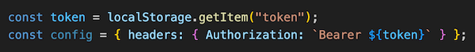

## Projektbeskrivning & Syfte

Detta projekt är en webbshop för livsmedel, utvecklad som en skoluppgift på Nackademin. Syftet är att träna på att bygga en fullständig e-handelsapplikation med både kundsida och adminpanel. Projektet är uppdelat i flera team (frontend, backend, testning) som samverkar.

---

## Innehållsförteckning

1. [Projektets Syfte & Översikt](#1-projektets-syfte--översikt)  
2. [Kodstruktur & Arkitektur](#2-kodstruktur--arkitektur)  
3. [Setup & Installation](#3-setup--installation)  
4. [Kodbibliotek & Teknologier](#4-kodbibliotek--teknologier)  
5. [Hjälp-funktioner](#5-hjälp-funktioner)  
6. [Autentisering](#6-autentisering)  
7. [Dashboard](#7-dashboard)  
8. [Kodflöde & Användarresa](#8-kodflöde--användarresa-frontend)  
9. [Viktiga JavaScript-filer](#9-viktiga-javascript-filer)  
10. [Att tänka på vid vidareutveckling](#10-att-tänka-på-vid-vidareutveckling)  
11. [Förbättringspunkter](#11-förbättringspunkter)  

---

## 1. Projektets Syfte & Översikt

### Kundsida

- Produkter hämtas från backend API och visas dynamiskt.
- Sökfunktion och paginering.
- Filtrering per kategori.
- Varukorg med offcanvas (sparas i localStorage).
- Checkout-sida med formulär.
- Bekräftelse-popup med Swish-information.

### Adminpanel

- Inloggning för administratörer.
- CRUD-funktionalitet för produkter och kategorier.
- Se inkomna kundbeställningar.
- Ändra orderstatus.
- Skapa plocklista.
- Sökning och paginering av produkter.

---

## 2. Kodstruktur & Arkitektur

---

## 3. Setup & Installation

### Krav

- **Node.js** version: `v20.19.0`
- **Sass** version: `1.86.0`

### Installation

\`\`\`bash
git clone https://github.com/dasl2001/BE-Webshop-2025-FE.git
cd BE-Webshop-2025-FE
npm install
\`\`\`

Installerar bland annat:

- `eslint` – kodstandard
- `prettier` – formatering
- `husky` & `lint-staged` – kodkontroll före commits
- `sass` – SCSS-kompilering

### Kompilera SCSS

**Alternativ 1: VS Code (Rekommenderat)**  
- Installera Live Sass Compiler extension  
- Klicka på **"Watch Sass"** längst ner  
- Kompilering: `src/scss/main.scss → public/css/main.css`

**Alternativ 2: Terminal**

\`\`\`bash
npm run sass
\`\`\`

Motsvarar:

\`\`\`bash
sass --no-source-map --watch src/scss/main.scss:public/css/main.css --style expanded
\`\`\`

**Observera**  
Kompilerad CSS ska **alltid** hamna i `public/css/main.css`.  
Skapa **inte** mappar som `dist/` eller `build/`.

---

## 4. Kodbibliotek & Teknologier

- **HTML5 & SCSS** – Struktur & styling
- **Vanilla JavaScript (ES6+)** – Funktionalitet
- **Fetch API** – HTTP-anrop
- **LocalStorage** – Sparar varukorg
- **Node.js**
- **Git & GitHub** – Versionshantering
- **Scrum** – Arbetssätt i team

---

## 5. Hjälp-funktioner

Återanvändbara funktioner ligger i `src/utils/`:

- `api.js` – Innehåller funktioner för GET/POST/PUT/DELETE till API
- `storageHelper.js` – Abstraktion av localStorage
- `utils.js` – Delade hjälpfunktioner för frontendlogik

---

## 6. Autentisering

- Login via `login.html`  
- Token sparas i localStorage  
- Skyddade vyer kräver token (kontrolleras i `admin-dashboard.js`)

---

## 7. Dashboard

Finns i `admin-dashboard.html`. Funktioner:

- Hantera produkter och kategorier
- Se och uppdatera beställningar
- CRUD via `admin-dashboard.js` och `order.js`

---

## 8. Kodflöde & Användarresa (Frontend)

### Kundflöde:

1. **Start** – Användaren landar på `index.html`
2. **Produkter laddas in** via `scripts/index.js` + `api.js`
3. **Sök & filter** styr produktlistan
4. **Varukorg** via `cart.js`, lagras i localStorage
5. **checkout.html** – formulär fylls i
6. **Popup** visas med Swish-info (ej riktig beställning)

### Adminflöde:

1. **login.html** – Token lagras i localStorage
2. **admin-dashboard.html** – Översiktssida
3. **CRUD-produkter** – `admin-dashboard.js`
4. **Beställningar** – `order.js` hämtar från API
5. **Statusuppdatering & plocklista`

---

## 9. Viktiga JavaScript-filer

| Fil                   | Funktion                                        |
|-----------------------|--------------------------------------------------|
| `index.js`            | Visar produkter, filtrering, sökning            |
| `cart.js`             | Hanterar varukorg (add/remove/update)          |
| `checkout.js`         | Validerar formulär, visar bekräftelse-popup    |
| `admin-dashboard.js`  | CRUD för produkter och kategorier               |
| `order.js`            | Hämtar & uppdaterar ordrar                      |
| `auth.js`             | Inloggning, tokenhantering                      |
| `utils/api.js`        | Gemensamma API-anrop med fetch                 |
| `utils/storageHelper` | Hantering av localStorage                      |

---

## 10. Att tänka på vid vidareutveckling

- Lägg till nya funktioner i rätt JS-fil eller utils-modul
- Importera `api.js` istället för att duplicera API-kod
- Kompilera SCSS → public/css/main.css
- Kontrollera token innan ni anropar skyddade endpoints
- Skapa inga nya mappar för CSS eller build-filer

---

## 11. Förbättringspunkter

- **Responsivitet:** Just nu anpassad för desktop – bör utökas till mobil & surfplatta
- **UX-förbättringar:** Till exempel laddningsindikator, feedback vid fel
- **Kodkommentarer:** Tydligare beskrivning i komplexa funktioner
- **Kodstruktur:** Fler SCSS-partials vid större projekt
- **Orderhantering:** Utöka adminlogik t.ex. genom att rensa varukorg först vid bekräftad order
- **Testbarhet:** Förbered frontend för enhetstester vid behov

